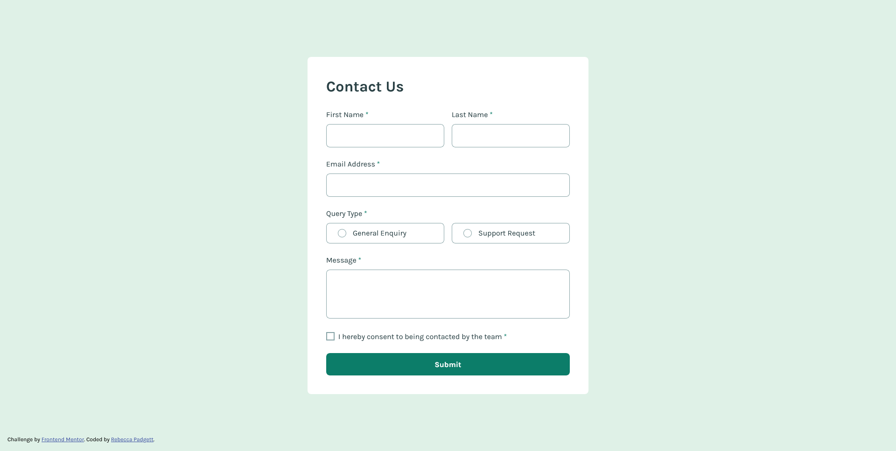

# Frontend Mentor - Contact form solution

This is a solution to the [Contact form challenge on Frontend Mentor](https://www.frontendmentor.io/challenges/contact-form--G-hYlqKJj). Frontend Mentor challenges help you improve your coding skills by building realistic projects. 

## Table of Contents 📚

- [Overview](#overview)
  - [The challenge](#the-challenge)
  - [Screenshot](#screenshot)
  - [Links](#links)
- [My process](#my-process)
  - [Built with](#built-with)
  - [Useful resources](#useful-resources)
- [Author](#author)
- [Suggestions](#suggestions)

## Overview

### The challenge

Users should be able to:

- Complete the form and see a success toast message upon successful submission
- Receive form validation messages if:
  - A required field has been missed
  - The email address is not formatted correctly
- Complete the form only using their keyboard
- Have inputs, error messages, and the success message announced on their screen reader
- View the optimal layout for the interface depending on their device's screen size
- See hover and focus states for all interactive elements on the page

### Screenshot

### Links

- Solution URL: [Frontend Mentor](https://www.frontendmentor.io/solutions/responsive-contact-form-using-html-css-and-javascript-dRslRNmXJq)
- Live Site URL: [GitHub Pages](https://bccpadge.github.io/contact-form-main/)

## My process

### Built with 🛠️
- HTML
  - Semantic HTML5 markup
  - Data attribures like `data-js-form` 
  - ARIA (Accessible Rich Internet Applications)

- CSS 
  - Native CSS Nesting
  - Flexbox
  - CSS Grid

- JavaScript
 - DOM maniplulation with `document.querySelector`
 - Event handling with `addEventListener` 
 - helper functions to write efficient code

### Useful resources 📚

- [Pure CSS Custom Style Radio Buttons](https://moderncss.dev/pure-css-custom-styled-radio-buttons/) - I used this article to create my own custom radio buttons from scratch.
- [Pure CSS Custom Style Checkbox](https://moderncss.dev/pure-css-custom-checkbox-style/) - I used this article to create my own custom checkbox from scratch.
[:user-valid & :user-invalid](https://www.youtube.com/shorts/jStzo0tlr6Y) - This is great video validating form inputs with plain CSS. In this project, I tried using them but decided to use JavaScript instead. 
- [Simplifying JavaScript Form Validation with Helper Functions](https://clouddevs.com/javascript/form-validation-with-helper-functions/) - Helper functions helped me write efficient code in JavaScript. 

## Author 👩‍💻
- [Rebecca Padgett](https://linkedin.com/in/rebeccapadgett121) on LinkedIn

## Suggestions 💡
Please don't hesitate to open an issue or make a pull request!

